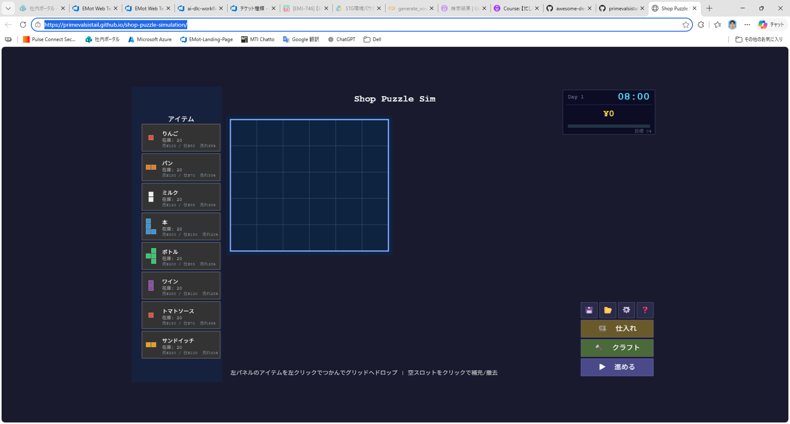
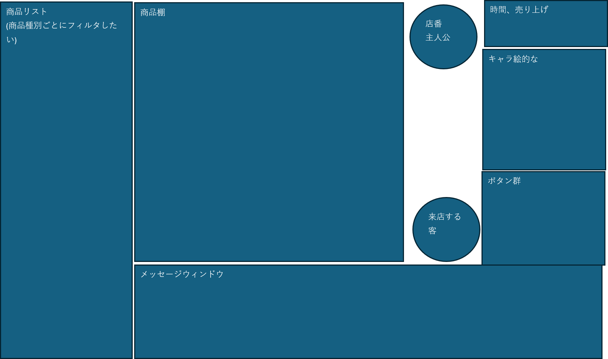

# 新機能・変更 要件確認

既存実装: 在庫配置パズル型 店舗経営シミュレーション（Unit 1〜5 完成, 101テスト通過）

どのような機能追加・変更を行いたいかを教えてください。

---

## Question 1
どのカテゴリの変更・追加を行いたいですか？

A) ゲームメカニクスの追加（新しいゲームプレイ要素）
B) コンテンツ追加（アイテム・レシピ・マップ拡張など）
C) UI/UX改善（操作性・見た目の改善）
D) バグ修正・既存機能の改善
E) Other (please describe after [Answer]: tag below)

[Answer]: C

---

## Question 2
追加・変更したい内容を具体的に教えてください。（自由記述）

[Answer]: 
今のデザインはこうなのですが、まずウィンドウ全体に広げるようにしたいです。
あと、こんな感じで配置したいのですが、UI/UX的なおすすめを聞きつつ進めたいです。
